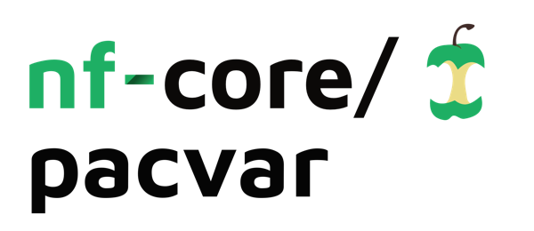
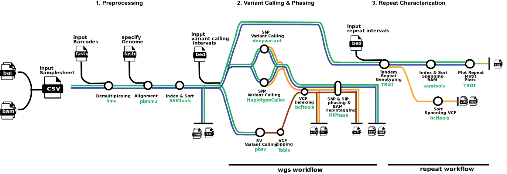

<h1>
  <picture>
    <source media="(prefers-color-scheme: dark)" srcset="docs/images/nf-core-pacvar_logo_dark.png">
    
  </picture>
</h1>

[](https://github.com/nf-core/pacvar/actions/workflows/ci.yml)
[](https://github.com/nf-core/pacvar/actions/workflows/linting.yml)[](https://nf-co.re/pacvar/results)[](https://doi.org/10.5281/zenodo.XXXXXXX)
[](https://www.nf-test.com)

[](https://www.nextflow.io/)
[](https://docs.conda.io/en/latest/)
[](https://www.docker.com/)
[](https://sylabs.io/docs/)
[](https://cloud.seqera.io/launch?pipeline=https://github.com/nf-core/pacvar)

[](https://nfcore.slack.com/channels/pacvar)[](https://twitter.com/nf_core)[](https://mstdn.science/@nf_core)[](https://www.youtube.com/c/nf-core)

## Introduction



1. Demultiplex reads ([`lima`](https://lima.how))
2. Align reads ([`pbmm2`](https://github.com/PacificBiosciences/pbmm2))
3. Sort and index alignments ([`SAMtools`](https://sourceforge.net/projects/samtools/files/samtools/))

wgs workflow

1. Choice of SNP calling routes:
   a. ([`deepvariant`](https://github.com/google/deepvariant))
   b. ([`HaplotypeCaller`](https://gatk.broadinstitute.org/hc/en-us/articles/360037225632-HaplotypeCaller))
2. Call SVs ([`pbsv`](https://github.com/PacificBiosciences/pbsv))
3. Index VCF files ([`bcftools`](https://samtools.github.io/bcftools/bcftools.html))
4. Phase SNPs, SVs and BAM files ([`hiphase`](https://github.com/PacificBiosciences/HiPhase))

repeat workflow

1. Genotype tandem repeats - produce spanning bams and vcf ([`TRGT`](https://github.com/PacificBiosciences/trgt))
2. Index and Sort tandem tepeat spanning bam ([`SAMtools`](https://sourceforge.net/projects/samtools/files/samtools/))
3. Plot repeat motif plots ([`TRGT`](https://github.com/PacificBiosciences/trgt))
4. Sort spanning VCF ([`bcftools`](https://samtools.github.io/bcftools/bcftools.html))

## Usage

First, prepare a samplesheet with your input data that looks as follows:

`samplesheet.csv`:

```csv
sample,bam,pbi
CONTROL,AEG588A1_S1_L002_R1_001.bam,AEG588A1_S1_L002_R1_001.pbi
```

Each row represents an unaligned bam file and their associated index.

Now, you can run the pipeline using:

```bash
nextflow run nf-core/pacvar \
   -profile <docker/singularity/.../institute> \
   --input samplesheet.csv \
   --workflow <wgs/repeat> \
   --barcodes barcode.fasta \
   --intervals intervals.bed \
   --outdir <OUTDIR>
```

optional paramaters include: --skip_demultiplexing, --skip_snp, --skip_sv, --skip_phase

> [!WARNING]
> Please provide pipeline parameters via the CLI or Nextflow `-params-file` option. Custom config files including those provided by the `-c` Nextflow option can be used to provide any configuration _**except for parameters**_; see [docs](https://nf-co.re/docs/usage/getting_started/configuration#custom-configuration-files).

For more details and further functionality, please refer to the [usage documentation](https://nf-co.re/pacvar/usage) and the [parameter documentation](https://nf-co.re/pacvar/parameters).

## Pipeline output

To see the results of an example test run with a full size dataset refer to the [results](https://nf-co.re/pacvar/results) tab on the nf-core website pipeline page.
For more details about the output files and reports, please refer to the
[output documentation](https://nf-co.re/pacvar/output).

## Credits

nf-core/pacvar was originally written by Tanya Sarkin Jain.

We thank the following people for their extensive assistance in the development of this pipeline:

## Contributions and Support

If you would like to contribute to this pipeline, please see the [contributing guidelines](.github/CONTRIBUTING.md).

For further information or help, don't hesitate to get in touch on the [Slack `#pacvar` channel](https://nfcore.slack.com/channels/pacvar) (you can join with [this invite](https://nf-co.re/join/slack)).

## Citations

<!-- TODO nf-core: Add citation for pipeline after first release. Uncomment lines below and update Zenodo doi and badge at the top of this file. -->
<!-- If you use nf-core/pacvar for your analysis, please cite it using the following doi: [10.5281/zenodo.XXXXXX](https://doi.org/10.5281/zenodo.XXXXXX) -->

An extensive list of references for the tools used by the pipeline can be found in the [`CITATIONS.md`](CITATIONS.md) file.

You can cite the `nf-core` publication as follows:

> **The nf-core framework for community-curated bioinformatics pipelines.**
>
> Philip Ewels, Alexander Peltzer, Sven Fillinger, Harshil Patel, Johannes Alneberg, Andreas Wilm, Maxime Ulysse Garcia, Paolo Di Tommaso & Sven Nahnsen.
>
> _Nat Biotechnol._ 2020 Feb 13. doi: [10.1038/s41587-020-0439-x](https://dx.doi.org/10.1038/s41587-020-0439-x).
